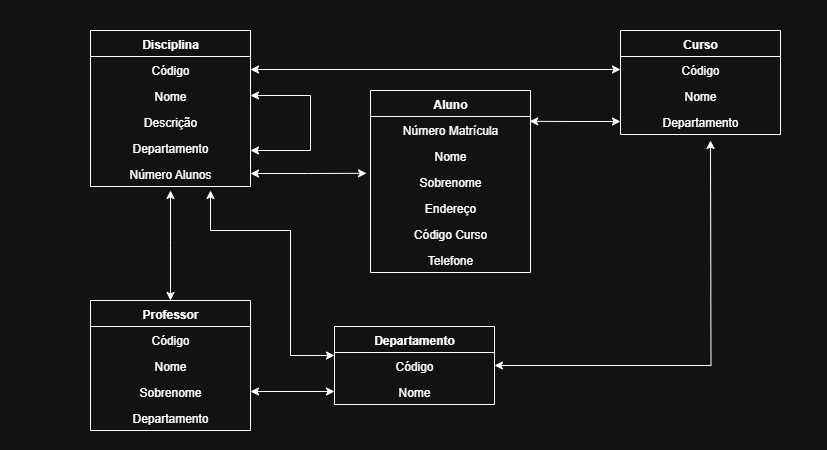

## Entidades
- Aluno.
- Professor.
- Departamento.
- Curso.
- Disciplina

---

## Relacionamentos

- Aluno está Matriculado em Curso.
- Aluno Cursa Disciplina.
- Aluno Realizou Disciplina.
- Disciplina Pertence a Curso.
- Professor Ministra Disciplina.
- Professor Pertence a Departamento.
- Departamento é Responsável por Disciplina.
- Departamento Controla Curso.
- Disciplina Depende de Disciplina.

---

## Atributos

#### Aluno:
- Número da matrícula.
- Nome.
- Sobrenome
- Endereço (rua, número, bairro, cep, cidade, estado).
- Código do Curso.

#### Professor:
- Código do Professor.
- Nome.
- Sobrenome
- Código do Departamento.

#### Disciplina:
- Código da Disciplina.
- Nome da Disciplina.
- Descrição curricular.
- Código do Departamento.
- Número de Alunos.

#### Curso:
- Código do Curso.
- Nome da Curso.
- Código do Departamento.

#### Departamento:
- Código da Departamento
- Nome do Departamento.

---

## Rascunho Inicial

