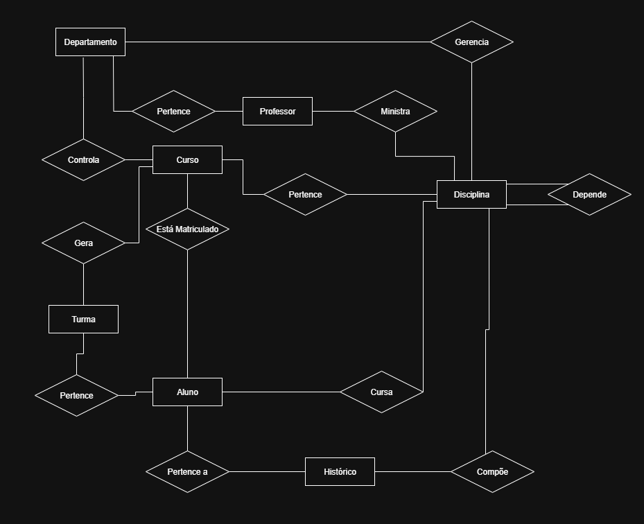
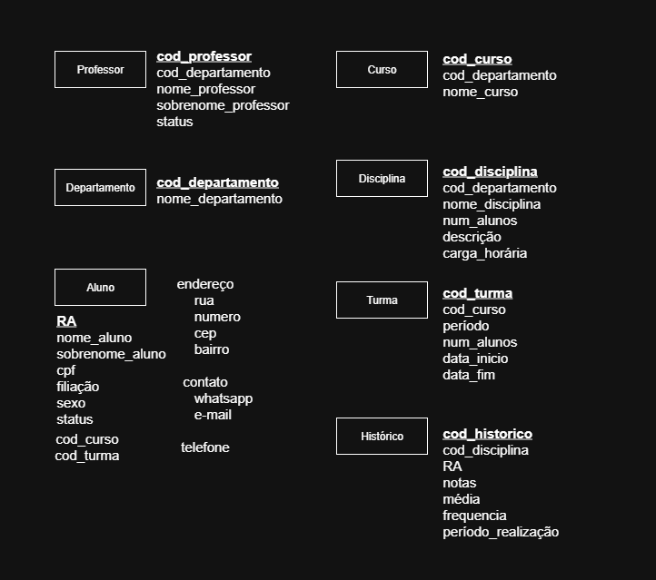
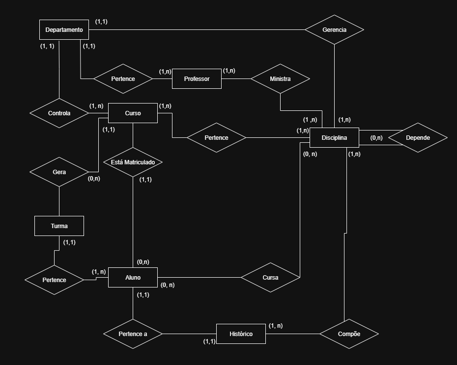
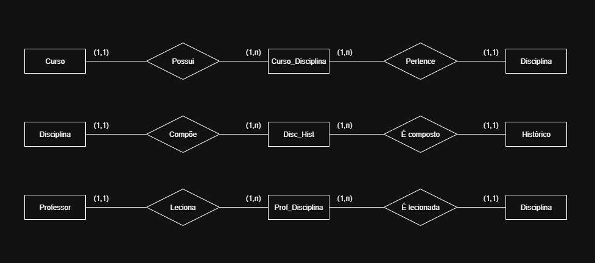

## Base dos Relacionamentos:

---

## Adicionando Atributos:

 

---

## Adicionando Cardinalidades:

---
## Eliminando Relacionamentos Muitos para Muitos:

> Necessário gerar Entidades Associativas para os relacionamentos

- Curso Pertence Disciplina
- Disciplina Compõe Histórico
- Professor Ministra Disciplina

---

