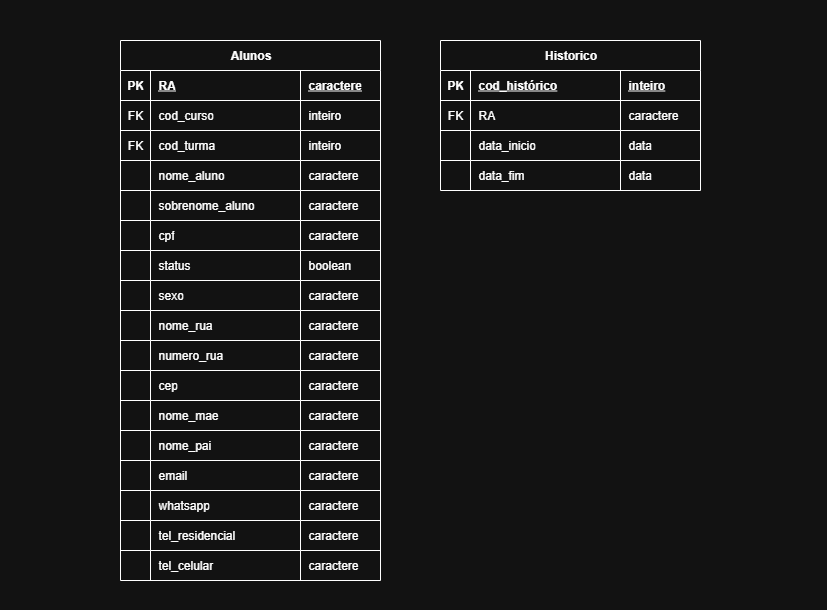

### A tabela está na 1º Forma Normal quando:

- Existe uma chave primária.
- Possui somente valores atômicos (indivisíveis).
- Não possui atributos multivalorados ou relações aninhadas.
- Não possui atributos compostos.

---
 **Tabela aluno**
 - Campo ``filiação`` é multivalorado.
 - Campo ``contato``é multivalorado.
 - Campo ``telefone`` é multivalorado.

 **Tabela Histórico**
 - Campo ``periodo_realização`` pode ser composto por data inicio e fim

---

### Com isso temos todas as tabelas na 1º Forma Normal

