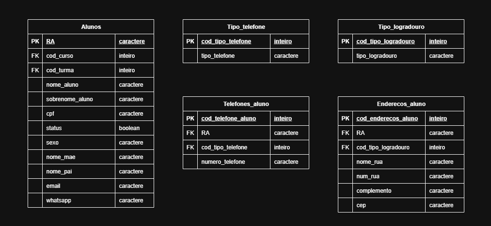

### A tabela está na 2ª Forma Normal quando:

- Está na 1FN.
- Todos os atributos não chave são funcionalmente dependentes da chave primária.
- Não existem dependências parciais, e atributos não dependem de chaves candidatas.

- Caso contrário, deve-se gerar uma nova tabela com os dados.

---

 **Tabela aluno**
 - Campo ``nome_rua, num_rua e cep``não dependem funcionalmente da PK.
 - Campo ``telefone, principalmente o residencial`` não depende diretamente da PK.
---

